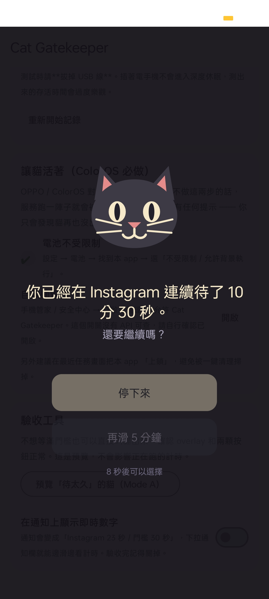

# mindgohua（麥勾滑）— Prototype

台語「麥溝滑」＝不要再滑了。偵測你在 Instagram / YouTube 等 app 裡的「無意識連續滑動」，用一隻全螢幕的貓打斷你。
全程在手機上處理，app 不具備網路權限。

<p align="center">
  
</p>

> **靈感來源：** 用貓打斷滑手機的概念來自 ZOKUZOKU 的
> [Cat Gatekeeper](https://zokuzoku.github.io/cat-gatekeeper/)（瀏覽器擴充功能 / 桌面版）。
> 本專案是在 Android 上獨立實作的版本，沒有使用原作的程式碼或素材（貓影片、圖示、logo）；
> app 裡的貓是專案自行繪製的向量圖。

依照 [`Mindgohua_Spec.md`](Mindgohua_Spec.md) 實作的第一階段原型。

Mode A（Privacy Mode）完整可用並通過實機驗收；Mode B（Focus Mode）管線已打通、
每日計數功能實機驗證過，但**節奏參數尚未用真實使用資料校準**，UI 上標示為「實驗中」，
預設仍是 Mode A。

**spec §8 六條驗收標準全數通過**（含 ColorOS 過夜存活 9 小時零中斷）。
實機環境：OPPO Reno7 5G（CPH2371）/ Android 13 / ColorOS，2026-07-24。

> **關於開發方式：** 本專案以 AI 協作開發。規格（[`Mindgohua_Spec.md`](Mindgohua_Spec.md)）、
> 需求取捨與實機驗收由作者負責，程式碼實作以 Claude Code 輔助完成。
> 文件中提到的「使用者要求」，指的是作者在開發過程中提出的需求變更。

---

## 怎麼建置

已在上述實機建置、安裝、驗收通過。

1. 用 Android Studio（Ladybug 以上）開啟本資料夾，等 Gradle Sync 完成。
2. 接上手機（開發測試機為 OPPO Reno7），開啟開發者選項與 USB 偵錯，然後：

```bash
./gradlew installDebug
```

只跑純邏輯測試（不需要實機、不需要 SDK 之外的東西）：

```bash
./gradlew :app:testDebugUnitTest
```

---

## 專案結構

```
app/src/main/java/com/mindgohua/
├── core/                       ← 純 Kotlin，不依賴 Android，可單元測試
│   ├── SessionEngine.kt           計時 / 冷卻 / 門檻 / GRACE 狀態機（spec §5）
│   ├── ScrollRhythmAnalyzer.kt    滑動節奏統計（spec §4）
│   ├── ItemAdvanceCounter.kt      數「滑過幾項」（只用清單位置，不讀內容）
│   └── DayBoundary.kt             一天從幾點開始（可設定）
├── stats/DailyStatsStore.kt    ← 每日計數持久化（spec §0.1 的例外）
├── detect/                     ← 可插拔偵測層（spec §2）
│   ├── Detector.kt                介面
│   ├── UsageStatsDetector.kt      Mode A
│   └── ScrollAccessibilityDetector.kt  Mode B
├── service/
│   ├── GatekeeperService.kt       Foreground Service，串起偵測→引擎→overlay
│   ├── ScrollWatchService.kt      AccessibilityService（只取時間戳）
│   └── BootReceiver.kt            開機重啟
├── overlay/OverlayController.kt   全螢幕貓（spec §6）
├── settings/                      DataStore，只存設定
└── ui/                            Compose 設定頁 + 權限引導 + 隱私說明
```

`SessionEngine` 不知道訊號來自哪個 detector，只吃抽象事件。這是 Mode A / B
能共用同一套打斷邏輯的原因，也是唯一被測試覆蓋到的關鍵路徑。

---

## 隱私原則怎麼被強制

spec §0 的原則不是靠註解，是靠會失敗的測試（`PrivacyInvariantTest`）：

| 原則 | 強制方式 |
|---|---|
| 不得連網 | manifest 沒有 `INTERNET`；測試會掃 manifest，加回去就紅 |
| 不得引入網路函式庫 | 測試會掃 `build.gradle.kts` 的相依清單 |
| 不讀畫面內容 | `canRetrieveWindowContent="false"`，測試會檢查 |
| 行為自限 | `ScrollWatchService` 動態設定 `serviceInfo.packageNames`，**非目標 app 的事件根本不會進到這個行程**——由系統過濾，不是靠程式自律 |
| 不落地 | ⚠️ **已放寬**，見下 |

### spec §0.1「不落地」的放寬（使用者要求）

原始 spec 要求任何讀到的資料判斷完立即丟棄、不寫入持久化儲存。
應使用者要求新增「每日滑動計數」功能後，這條原則被**刻意放寬**。
放寬的確切範圍：

**會寫入磁碟的完整清單**（`DailyStatsStore`）：

| 欄位 | 例 |
|---|---|
| 日期 | `2026-07-24` |
| package name | `com.instagram.android` |
| 一個整數 | `342` |

**不會寫入**：時間戳序列、什麼時段在用、滑了什麼內容。
從這份資料還原不出你的作息，只知道「那天總共多少」。

其他防線不變：仍然沒有 `INTERNET` 權限，所以這些數字寫得進去、出不了這台手機。

此功能**預設關閉**（`statsEnabled = false`），必須由使用者主動開啟 ——
它改變了 app 的隱私姿態，不該讓人在不知情的狀況下承受。
app 內的隱私說明會跟著開關變動，不會留一個過期的承諾在畫面上。

---

## 驗收標準對照（spec §8）

**實機操作步驟見 [TESTING.md](TESTING.md)。**

### Mode A（第一階段）

實機驗證環境：**OPPO Reno7 5G（CPH2371）/ Android 13 / ColorOS**，2026-07-23。

| # | 項目 | 單元測試 | 實機 |
|---|---|---|---|
| 1 | 可選目標 app、設門檻 | — | ✅ |
| 2 | 超過門檻 → 貓 overlay | ✅ `連續使用超過門檻會觸發打斷` | ✅ |
| 3 | 短暫切出切回不歸零 | ✅ `冷卻期內切回來計時繼續累計`（含反例）| ✅ 含反例 |
| 4 | 兩顆按鈕 + GRACE | ✅ `解除後在GRACE期內不會再打斷` | ✅ 含解禁倒數與長按 |
| 5 | 無網路、不落地 | ✅ `PrivacyInvariantTest` | ✅ `dumpsys` 查無 INTERNET |
| 6 | ColorOS 長時間存活 | — | ✅ **9 小時零中斷**（過夜，拔電源）|

單元測試 42 個全過：`SessionEngineTest` 14、`ItemAdvanceCounterTest` 11、
`ScrollRhythmAnalyzerTest` 8、`DayBoundaryTest` 6、`PrivacyInvariantTest` 3。

### 每日計數（spec 之外，使用者需求）

| 項目 | 狀態 |
|---|---|
| 計數邏輯（含防灌水規則） | ✅ 11 個單元測試 |
| 換日邊界（可設定幾點歸零） | ✅ 6 個單元測試 |
| 每日紀錄持久化 + 自動清除舊資料 | ✅ 已實作 |
| 右上角即時 HUD | ✅ 實機驗證 |
| **IG 是否真的提供清單位置資料** | ✅ **有，計數準確**（Reels 實測）|
| 換日邊界在真實環境生效 | ✅ 凌晨 01:00 的滑動正確記入前一天 |
| 資料確實落到磁碟 | ✅ `run-as` 驗證，檔案 42 bytes |

`fromIndex`/`toIndex`/`itemCount` 是**選填**欄位，很多 app 不設。
IG 有設，所以數得出來；換別的 app 不保證。UI 上有「量不到」的明確提示，
不會在數不出來的時候顯示一個看似正常的 0。

磁碟上實際的內容長這樣（`adb shell run-as com.mindgohua cat files/datastore/...`）：

```
c|2026-07-23|com.instagram.android
```

整個歷史紀錄檔 42 bytes。文件寫的就是磁碟上的東西。

### Mode B（已接進驗收流程）

Mode B 的難處是它有三段可能斷掉，所以設定頁的「Mode B 驗收」卡片按這三段分開顯示：

| 段 | 檢查項 | 顯示位置 |
|---|---|---|
| 1. 服務連上了嗎 | 無障礙服務已在系統開啟 / 已連線到本程式 | 設定頁 ✔ 燈號 |
| 2. 事件進來了嗎 | 「已從目標 app 收到 N 個滑動事件」 | 設定頁計數器 |
| 3. 統計量跨過門檻了嗎 | 密度 / CV / 持續時間 / 樣本數，各自標「目前值 vs 門檻」 | 設定頁 + **常駐通知** |

關鍵設計是**診斷通知**：你滑 IG 的當下看不到設定頁，所以打開這個開關後，
即時數字會顯示在常駐通知上，下拉通知欄就能一邊滑一邊看自己的密度與 CV。
這是調參唯一實際可行的方式。

另外，離開目標 app 時數字**刻意不歸零**（畫面上會標示「這是離開前的最後一筆」），
否則滑完 IG 回到設定頁只會看到一片 0。

診斷數字只有統計量與計數，不含時間戳序列或 package name，只存在記憶體，服務停掉就清空。

剩下的只有「用真實資料調參」——流程寫在 [TESTING.md 第 5 步](TESTING.md)。

---

## 防馴化設計（spec §6）

第一版做了兩層，因為「秒點就消失的按鈕」兩週後會退化成反射動作：

1. 貓出現後 **3 秒內兩顆按鈕都不能按**（可調 0–10 秒），畫面上有倒數。
2. 「再滑 N 分鐘」那顆要**按住 2 秒**才生效，並顯示進度百分比。
   「停下來」是單擊即可——不該讓做對的事比較費力。

另外 overlay 會吃掉返回鍵，不然一鍵 back 就跳過打斷了。

---

## ColorOS 存活測試（spec §7，驗收關鍵指標）

OPPO / ColorOS 會殺掉 foreground service 且**不給任何提示**，
使用者只會發現貓再也沒出現過。所以這一項要當成功能來測。

### 前置設定（app 內「讓貓活著」區塊有按鈕帶過去）

1. 設定 → 電池 → mindgohua → **不受限制 / 允許背景執行**
2. 手機管家 / 安全中心 → **自啟動管理** → 允許 mindgohua
   （這個開關沒有公開 API 可查，只能靠使用者自己確認）
3. 最近任務畫面把本 app **上鎖**，避免一鍵清理掃掉

### 測試程序

```bash
# 1. 啟動後記錄 PID
adb shell pidof com.mindgohua

# 2. 每 10 分鐘檢查一次是否還活著、PID 有沒有變（變了代表被殺後重啟）
adb shell "while true; do echo \$(date +%H:%M) \$(pidof com.mindgohua); sleep 600; done"

# 3. 確認 foreground service 仍在
adb shell dumpsys activity services com.mindgohua | grep -i "isForeground\|app="

# 4. 看是否被系統以省電理由停掉
adb logcat -d | grep -iE "mindgohua|force stop|anr|killing"
```

### 通過條件

- 螢幕關閉 + 切換多個 app 後，**連續存活 ≥ 4 小時**，PID 不變。
- 期間打開 IG 滑超過門檻，貓仍會出現。
- 若 PID 變了但服務有回來（`START_STICKY` 或 `BootReceiver` 生效），記錄重啟間隔——
  可以接受，但要確認重啟後計時邏輯正常。

### 分階段記錄

建議至少測三種情境，因為失效模式不同：

| 情境 | 觀察重點 |
|---|---|
| 螢幕開著、前景使用其他 app | 幾乎不會被殺，基準線 |
| 螢幕關閉 1 小時 | ColorOS 深度睡眠的主要殺手 |
| 螢幕關閉過夜（8 小時） | 最嚴苛；多半需要自啟動白名單才過得了 |

---

## 已知風險與未完成項目

- **ColorOS 存活只在單一機型驗證過。** Reno7 過夜 9 小時零中斷，但其他 OEM
  （小米、vivo、三星）的殺後台策略不同，不保證同樣結果。步驟見 [TESTING.md 第 6 步](TESTING.md)。
- **Mode B 參數未校準。** `RhythmConfig` 的預設值是憑常識抓的起點。
  設定頁把四個參數都開放調整、並提供即時數字，就是為了拿真實資料反覆試。
  模擬顯示「認真但滑很快」的密度會超標（18.7/分），擋下來的是變異係數——
  **兩個門檻必須一起調**，只調密度會把認真使用的人也打斷。
- **`UsageStatsDetector` 2 秒輪詢一次。** 對分鐘級門檻夠用，但耗電量沒實測過。
- **ColorOS 自啟動 intent 是脆弱的。** 那些 component name 是 OEM 私有介面，
  改版就可能失效，所以 UI 上同時附了文字步驟。
- **overlay 蓋不住系統關鍵畫面**（權限框、部分系統設定）。這是 Android 的保護機制，
  spec §6 明確說不用處理。
- 沒有做 instrumented test。overlay 的行為只能靠設定頁的兩顆「預覽」按鈕手動驗
  （Mode A 與 Mode B 的文案不同，各有一顆）。
- 診斷通知每 2 秒重畫一次，只該在調參時開。預設是關的。
